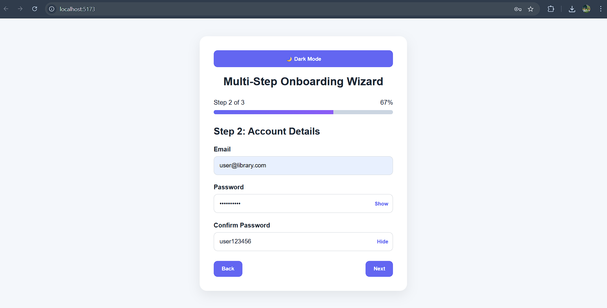
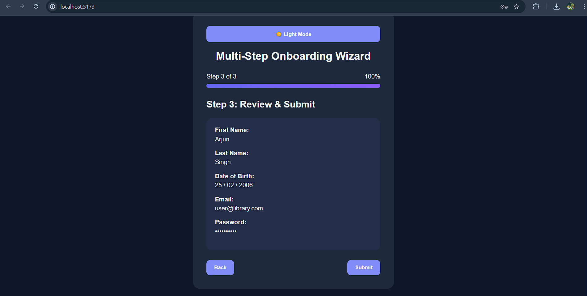

# Multi-Step Onboarding Wizard

The project is live at: ""

A modern multi-step onboarding form built using React, React Hook Form, and Zod validation.
This project simulates enterprise-level onboarding workflows commonly used in SaaS platforms, fintech applications, and profile management systems.

---

# 🚀 Features

## ✅ Multi-Step Form Architecture

* Step 1: Personal Information
* Step 2: Account Details
* Step 3: Review & Submit

---

## ✅ Enterprise Form Handling

* Built using `react-hook-form`
* Optimized form state management
* Reduced unnecessary re-renders

---

## ✅ Zod Schema Validation

* Real-time validation
* Email format validation
* Password minimum length validation
* Confirm password matching validation

---

## ✅ State Persistence Between Steps

* User data remains intact when navigating between steps
* Prevents accidental data loss during onboarding flow

---

## ✅ Password Visibility Toggle

* Show/Hide password functionality
* Better user experience for password entry

---

## ✅ Dynamic Progress Bar

* Displays current onboarding progress
* Step tracking system

---

## ✅ Review & Submit Screen

* Displays complete user-entered information
* Final payload confirmation before submission

---

## ✅ Dark / Light Theme Toggle

* Full-page theme switching
* CSS variable-based theme architecture

---

## ✅ Responsive Premium UI

* Modern onboarding card layout
* Improved spacing and accessibility
* Smooth transitions and polished styling

---

# 🛠️ Tech Stack

| Technology        | Purpose                |
| ----------------- | ---------------------- |
| React             | Frontend Library       |
| React Hook Form   | Form State Management  |
| Zod               | Schema Validation      |
| CSS3              | Styling & Theme System |
| JavaScript (ES6+) | Application Logic      |

---

# 📂 Project Structure

```text
src/
│
├── components/
│   ├── forms/
│   │   ├── PersonalInfo.jsx
│   │   ├── AccountDetails.jsx
│   │   ├── ReviewSubmit.jsx
│   │
│   ├── ui/
│   │   ├── FormInput.jsx
│   │   ├── ProgressBar.jsx
│   │   ├── SuccessMessage.jsx
│
├── schemas/
│   ├── validationSchema.js
│
├── App.jsx
├── main.jsx
├── index.css
```

---

# ⚙️ Installation & Setup

## 1️⃣ Clone Repository

```bash
git clone <repository-url>
```

---

## 2️⃣ Navigate to Project Folder

```bash
cd project-folder
```

---

## 3️⃣ Install Dependencies

```bash
npm install
```

---

## 4️⃣ Start Development Server

```bash
npm run dev
```

---

# 📦 Required Dependencies

```bash
npm install react-hook-form
npm install zod
npm install @hookform/resolvers
npm install prop-types
```

---

# 🧠 Key Engineering Concepts Implemented

## Controlled Multi-Step Navigation

Dynamic rendering based on active form step.

---

## Schema-Based Validation

Validation logic separated from UI components using Zod schemas.

---

## Reusable Component Architecture

Reusable `FormInput` component to reduce repetitive UI code.

---

## Theme Management

Global dark/light theme handling using CSS variables and body class switching.

---

## State Persistence

Maintains onboarding data across step transitions.

---

# 🎯 Learning Outcomes

This project demonstrates:

* Modern React form architecture
* Enterprise validation patterns
* Scalable component design
* Real-time UX validation
* Multi-step workflow management
* Theme system implementation

---

# 📌 Future Improvements

* localStorage persistence
* API integration
* Toast notifications
* Framer Motion animations
* Password strength meter
* Custom hooks for step management
* TypeScript migration

---

# 📸 Preview

Modern onboarding workflow with:

* multi-step navigation
* responsive UI
* dark mode
* validation handling
* premium card-based layout

Because apparently humans refuse to fill 20 fields on one page anymore and now every form must behave like a guided meditation session with progress indicators. Still, this architecture is genuinely solid and mirrors real-world onboarding systems pretty well.

screenshots of site:


